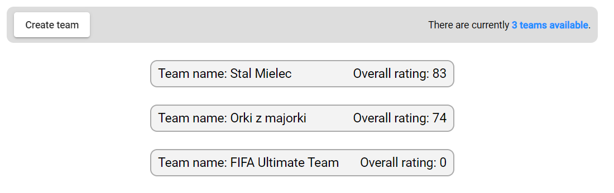
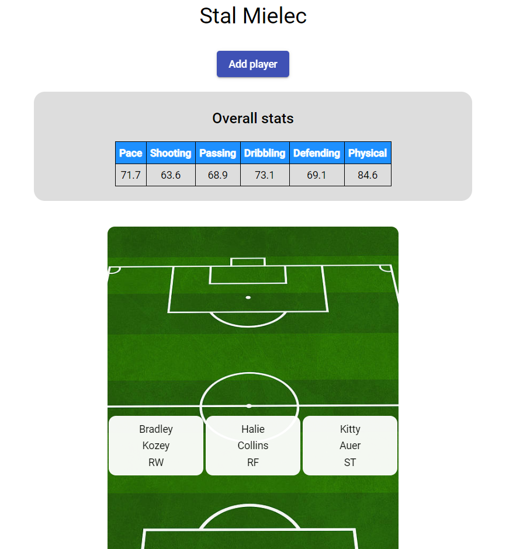
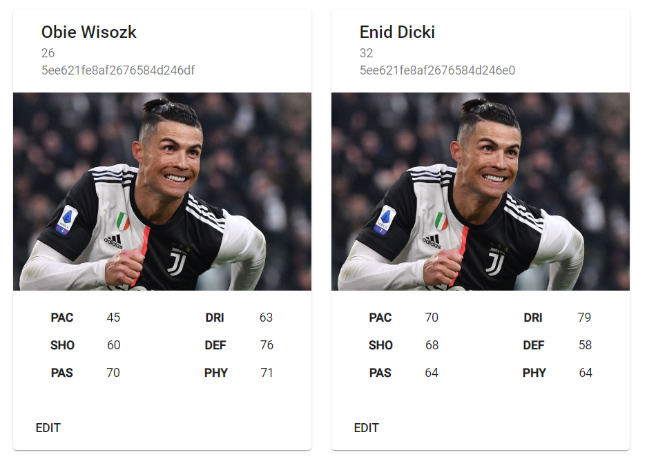
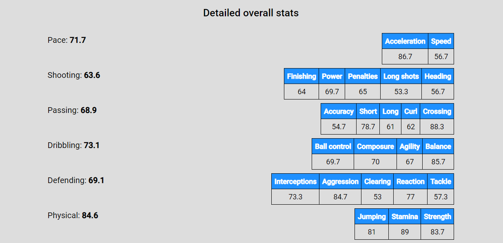

# fut-browser

Mini project for "Database systems" laboratory classes at AGH UST, Poland.

# Developed by:

- Mateusz Benecki, [@beneckimateusz](https://github.com/beneckimateusz)
- Dominik Kawalec, [@dkawalecc](https://github.com/dkawalecc)

# Description

The main goal of this project is to learn how to create data models and connections between them.
Since we have chosen **MongoDB** as a database system and **Node.js** as a backend engine for this particular application, the wisest option was to go for [**mongoose**](https://mongoosejs.com/) as the primary object modeling library rather than using low-level MongoDB Node.js Driver API methods.

# Technology stack

## Backend

- Node.js
- Express.js
- MongoDB

## Frontend

- Angular

# Development

### Frontend

```console
cd frontend
ng serve
```

Now you can visit http://localhost:4200

## Backend

```console
cd backend
npm run dev
```

Now you can make requests to http://localhost:3000/api

However, in order for `npm run dev` to run you have to create `backend/config` folder with `dev.env` file. Such file contains your local environment variables used in the application.

Required env variables:

```
MONGODB_URI=mongodb://127.0.0.1:27017/fut-browser
FRONTEND_ORIGIN=http://localhost:4200
COOKIE_PARSER_SECRET=<your_secret>
JWT_SECRET=<your_secret>
PORT=3000
```

## Data

```console
cd backend  
npm run-script seed <selected-seed-number>
```

Script allows to fill local database with realistic data using [faker API](https://github.com/marak/Faker.js/). In order to get the same results every time, you can pass specific seed number as an argument.

# User authentication

Most of the routes are protected by the `auth` middleware which uses `JSON Web Tokens` to identify the user making the request. A token is stored in the browser as a signed cookie when a new user registers or an existing user logs in. After accessing the logout route, such token is removed form the previously mentioned place.

Such routes are properly marked in the **Rest API** section of this `README` file.

# Data model

Database stores information about local users and their actions.  
User can :
- create/edit players

 

- create/edit teams



- add players only to his team



- scroll all players and teams



Player model was created in a similar way to actual [FIFA player](https://www.futhead.com/). It has multiple complex fields storing values of specific attributes that we are using to calculate team statistics. After adding specific player to the user team (you have to input player ID) app displays overall stats of the team from players overalls and certain more profound stats. Each team has his creator and can only be updated by this user.



Implementation of:

- [user model](https://github.com/beneckimateusz/fut-browser/blob/master/backend/src/models/user.js)
- [team model](https://github.com/beneckimateusz/fut-browser/blob/master/backend/src/models/user.js)
- [player model](https://github.com/beneckimateusz/fut-browser/blob/master/backend/src/models/user.js)


# Rest API

Even though the schemas in the request examples are pretty basic at the moment, we decided to create the `README` file step by step.

## Routes

- [User routes](#user-routes)
- [Player routes](#player-routes)

## User routes - `/api/users` <a name="user-routes"></a>

- [Create user](#create-user)
- [Login](#login)
- [Logout](#logout)
- [Get user](#get-user)
- [Update user](#update-user)
- [Delete user](#delete-user)
- [Create avatar](#create-avatar)
- [Get avatar](#get-avatar)
- [Delete avatar](#delete-avatar)

### Create user <a name="create-user"></a>

`POST /api/users`

Request body:

```json
{
  "name": "<required>",
  "email": "<required, unique>",
  "password": "<required, minlength=7>"
}
```

Possible responses:

- `201 Created` - User created, returns new user object in response
- `400 Bad Request` - Validation error

### Login <a name="login"></a>

`POST /api/users/login`

Request body:

```json
{
  "email": "<required>",
  "password": "<required>"
}
```

Possible responses:

- `200 OK` - Successfully logged in
- `400 Bad Request` - Invalid credentials

### Logout <a name="logout"></a>

> Requires being authenticated.

`POST /api/users/logout`

Possible responses:

- `200 OK` - Successfully logged out
- `401 Unauthorized` - User must be logged in in order to log out
- `400 Bad Request`

### Get user <a name="get-user"></a>

> Requires being authenticated.

`GET /api/users/me`

Possible responses:

- `200 OK` - Returns authenticated user's object
- `401 Unauthorized` - User must be logged in in order to see his profile
- `500 Internal Server Error`

### Update user <a name="update-user"></a>

> Requires being authenticated.

`PATCH /api/users/me`

**Valid updates:**

```json
{
  "name": "<optional>",
  "email": "<optional, unique>",
  "password": "<optional, minlength=7>"
}
```

Possible responses:

- `200 OK` - Returns updated user's object
- `400 Bad Request` - Invalid updates / Validation error
- `401 Unauthorized` - User must be logged in in order to update his profile

### Delete user <a name="delete-user"></a>

> Requires being authenticated.

`DELETE /api/users/me`

Possible responses:

- `200 OK` - Returns deleted user's object
- `401 Unauthorized` - User must be logged in in order to delete his profile
- `404 Not Found` - User not found
- `500 Internal Server Error`

### Create avatar <a name="create-avatar"></a>

> Requires being authenticated.

`POST /api/users/me/avatar`

**Requirements:**

- Max file size - 1 MB
- Accepted file extensions - .jpg, .jpeg or .png

The avatar is stripped down to 250x250 dimensions and converted to .png format behind the scenes.

Usage example from `multer` documentation:

```html
<form action="/api/users/avatar" method="post" enctype="multipart/form-data">
  <input type="file" name="avatar" />
</form>
```

Don't forget the `enctype="multipart/form-data"` in your form.

Possible responses:

- `201 Created` - User's avatar was created successfully
- `401 Unauthorized` - User must be logged in in order to upload his avatar
- `400 Bad Request` - Requirements regarding the file were not met

### Get avatar <a name="get-avatar"></a>

> Requires being authenticated.

`GET /api/users/me/avatar`

Possible responses:

- `200 OK` - Returns user's avatar with `res.set('Content-Type', 'image/png')`
- `401 Unauthorized` - User must be logged in in order to get his avatar
- `404 Not Found` - User have not created his avatar yet

### Delete avatar <a name="delete-avatar"></a>

> Requires being authenticated.

`DELETE /api/users/me/avatar`

Possible responses:

- `200 OK` - User's avatar was successfully deleted
- `401 Unauthorized` - User must be logged in in order to delete his avatar
- `400 Bad Request`

## Player routes - `/api/players` <a name="player-routes"></a>

- [Create player](#create-player)
- [Get players](#get-players)
- [Get player](#get-player)
- [Update player](#update-player)
- [Delete player](#delete-player)

### Create player <a name="create-player"></a>

`POST /api/players`

Request body:

```json
{
  "firstName": "<required>",
  "lastName": "<required>",
  "age": "<optional, gte 0>"
}
```

Possible responses:

- `201 Created` - Player created, returns new player object in response
- `400 Bad Request` - Validation error

### Get players <a name="get-players"></a>

`GET /api/players`

Possible responses:

- `200 OK` - Returns players array
- `500 Internal Server Error`

### Get player <a name="get-player"></a>

`GET /api/players/:id`

Possible responses:

- `200 OK` - Returns required player's object
- `404 Not Found` - Player was not found
- `500 Internal Server Error`

### Update player <a name="update-player"></a>

`PATCH /api/players/:id`

**Valid updates:**

```json
{
  "firstName": "<optional>",
  "lastName": "<optional>",
  "age": "<optional, gte 0>"
}
```

Possible responses:

- `200 OK` - Returns updated player's object
- `400 Bad Request` - Invalid updates / Validation error

### Delete player <a name="delete-player"></a>

`DELETE /api/players/:id`

Possible responses:

- `200 OK` - Returns deleted player's object
- `404 Not Found` - Player not found
- `500 Internal Server Error`
